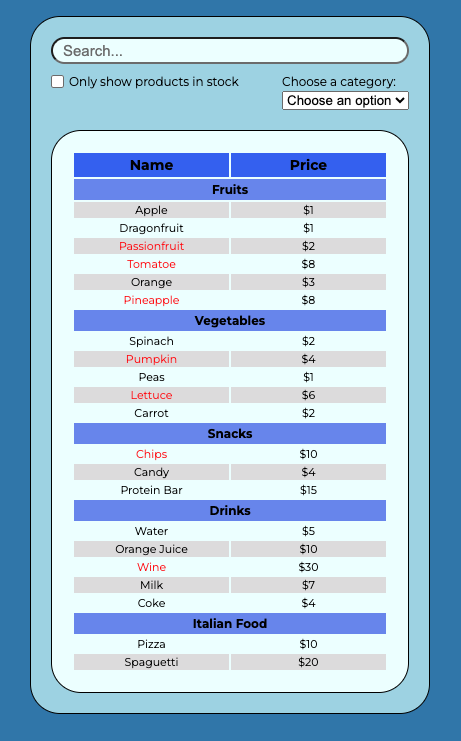
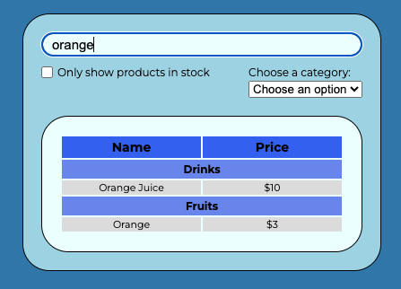
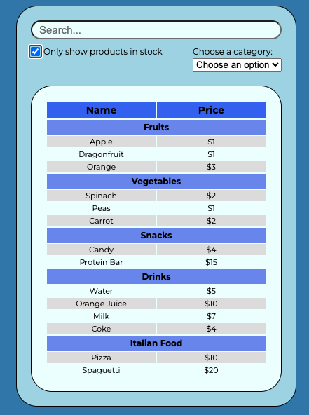
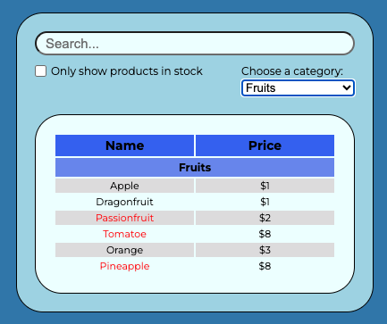

<h1>Inventory Table</h1>
<h2>
This was a project  from React.dev web page where we use React to build a inventory table to display products by category, their prices and if are avaiable in stock.
</h2>

<h3>The Project</h3>

This project consists of a simple inventory table with the following funcionalities and characteristics:

<ul>
  <li>
    A search bar where you can search by name, stock availability and category.
  </li>
  <li>
    A table with two columns: name of the product and price.
  </li>
  <li>
    Each product is displayed under its specific category.
  </li>
  <li>
    Products that are out of stock are in red.
  </li>

 </ul>

 

  The table has the following requirements:

<ul>
  <li>
    If nothing is typed in the text input, the table has to show all products.
  </li>
  <li>
    Once something is typed in the text input, the table filters the products that contains the searched text.
  </li>
  <li>
    If the products in stock checkbox is checked, the table only shows the products that are in stock.
  </li>
  <li>
    If an specific category is chosen, the table only shows the products in that category.
  </li>
 </ul>

<h3>Technologies</h3>

<ol>
  <li>
  HTML
    <ul>
      <li>Class</li>
      <li>Id</li>
      <li>Google Fonts</li>
      <li>Form</li>
      <li>Input: text and checkbox</li>
      <li>Select and options</li>
      <li>Table</li>
    </ul>
  </li>

  <li>
  CSS
    <ul>
      <li>Display Flex</li>
      <li>Class Selector</li>
      <li>Pseudo Selectors (nthchild)</li>
    </ul>
  </li>

  <li>
  JavaScript
    <ul>
      <li>Functions</li>
      <li>Arrow Functions</li>
      <li>Loops</li>
      <li>Conditionals</li>
    </ul>
  </li>

  <li>
  React
    <ul>
      <li>States</li>
      <li>Effect</li>
      <li>Props</li>
      <li>Components</li>
    </ul>
  </li>
</ol>

<h3>Screenshots</h3>

  <caption>Inventory table initial state.</caption>
  

  
  

  <caption>Inventory table search by product.</caption>
  

  
  

  <caption>Inventory table stock search.</caption>
  

  
  

  <caption>Inventory table search by category.</caption>
  

  
  

